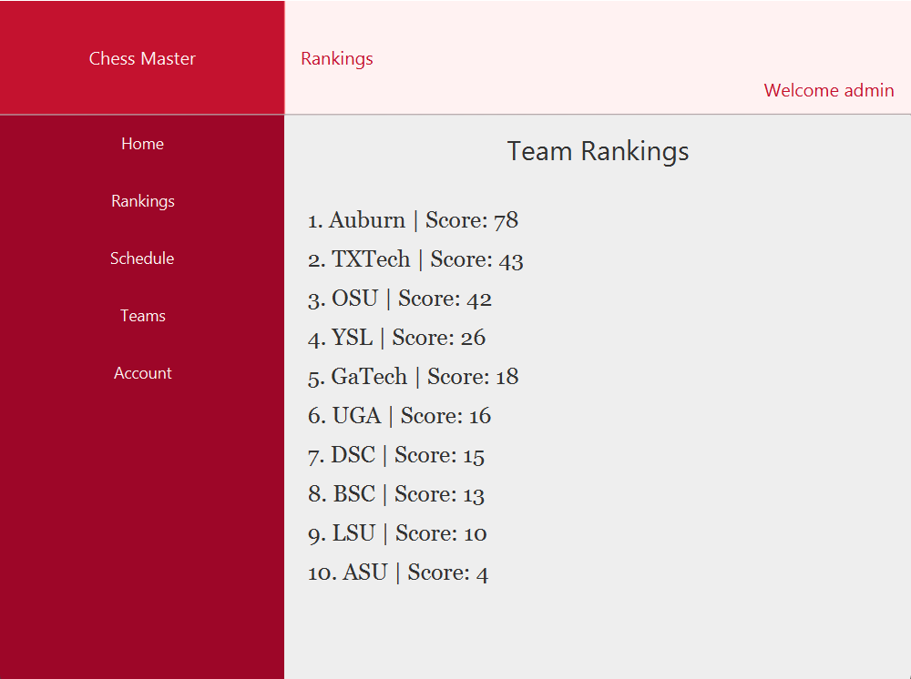

<h1>Chess Master: A tournament generator</h1>

<h2>Download</h2>

The Chess Master in currently not available yet, but look forward to it!

<h2>Bugs and Feature Request</h2>

Found a bug or want to request a feature? Create a new issue and we will take a look at it.

<h2>Contributing</h2>

Please read our <a href="SEProjectQuestions.docx">Code of Conduct</a>. 
Included are directions on how to handle pull requests, coding standards, and notes on development

<h2>Documentation</h2>

Check out our open source <a href="SEProjectQuestions.docx">documentation</a>

<h2>Developement</h2>

Development can be done on Mac, Windowns, and Linux as long as you have access to <a href="https://openjfx.io/">JavaFX</a>

<h2>License</h2>

<a href="https://www.daltonstate.edu/">DSC</a> &#169; 
<a href="https://github.com/ksturdivantwilson/SoftwareEngProject/edit/main/README.md">Chess Master</a>

